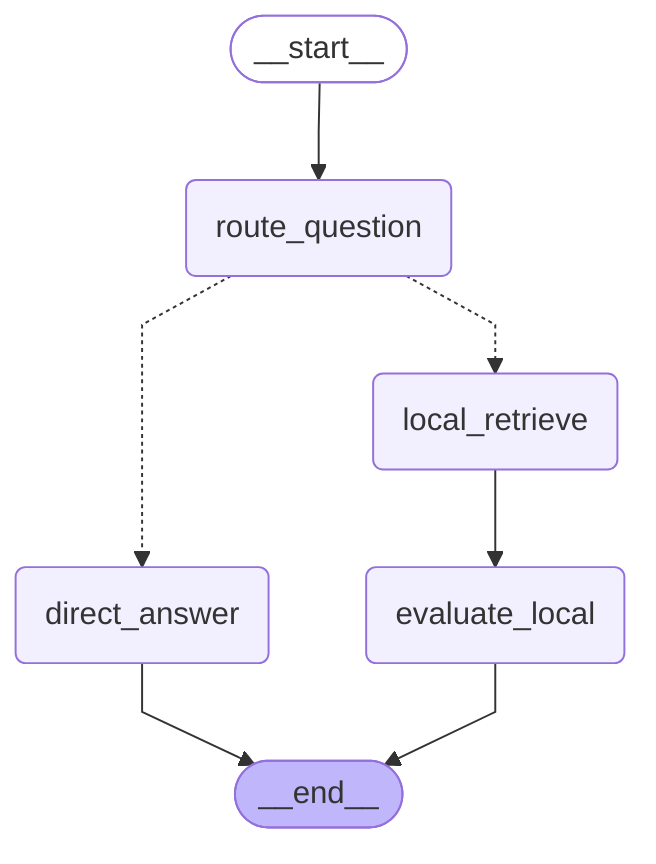

```mermaid
%%{init: {'flowchart': {'curve': 'linear'}}}%%
graph TD;
        __start__([<p>__start__</p>]):::first
        route_question(route_question)
        direct_answer(direct_answer)
        local_retrieve(local_retrieve)
        evaluate_local(evaluate_local)
        __end__([<p>__end__</p>]):::last
        __start__ --> route_question;
        direct_answer --> __end__;
        evaluate_local --> __end__;
        local_retrieve --> evaluate_local;
        route_question -.-> direct_answer;
        route_question -.-> local_retrieve;
        classDef default fill:#f2f0ff,line-height:1.2;
        classDef first fill-opacity:0;
        classDef last fill:#bfb6fc;
```