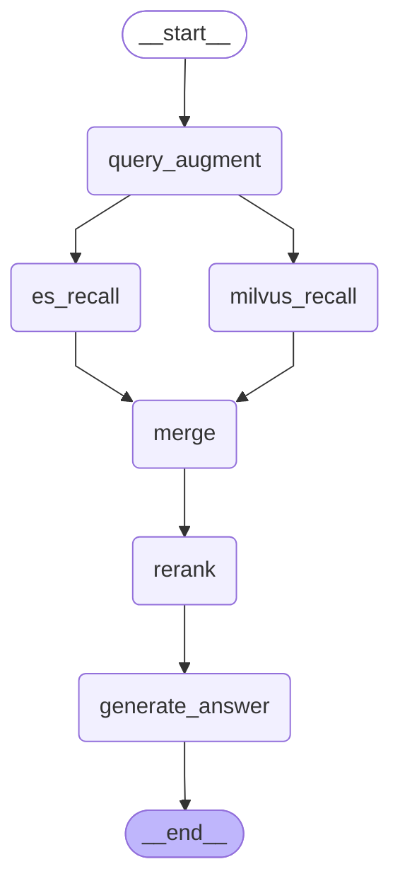

```mermaid
%%{init: {'flowchart': {'curve': 'linear'}}}%%
graph TD;
        __start__([<p>__start__</p>]):::first
        query_augment(query_augment)
        es_recall(es_recall)
        milvus_recall(milvus_recall)
        merge(merge)
        rerank(rerank)
        generate_answer(generate_answer)
        __end__([<p>__end__</p>]):::last
        __start__ --> query_augment;
        es_recall --> merge;
        merge --> rerank;
        milvus_recall --> merge;
        query_augment --> es_recall;
        query_augment --> milvus_recall;
        rerank --> generate_answer;
        generate_answer --> __end__;
        classDef default fill:#f2f0ff,line-height:1.2;
        classDef first fill-opacity:0;
        classDef last fill:#bfb6fc;
```